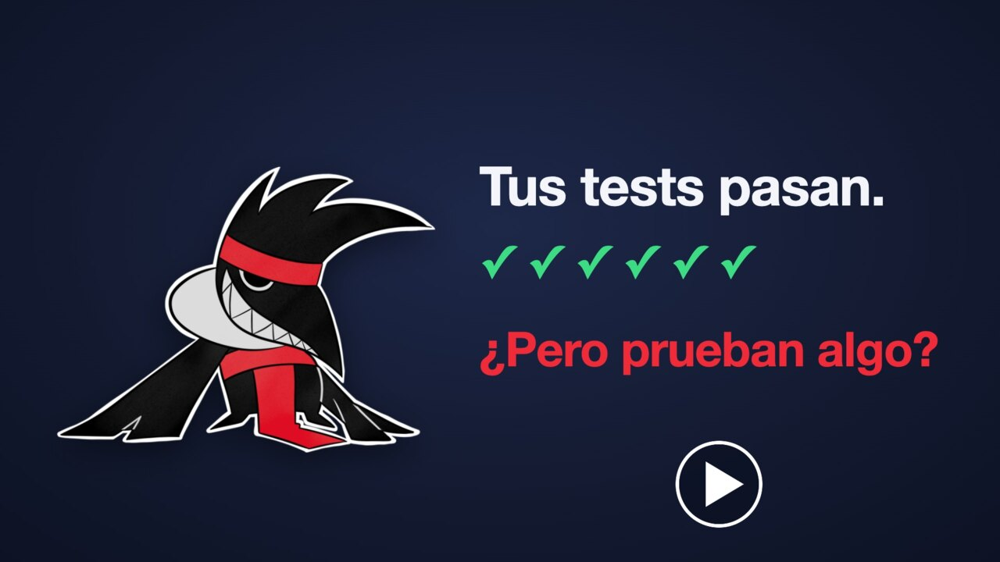

# kalku

<p align="center">
  
</p>

<p align="center"><a href="README.md">English</a> · <b>Español</b></p>

**Mutation testing para personas, CI y agentes de código.** Nativo donde un lenguaje no lo tiene, y una sola barrera honesta sobre las herramientas que ya existen.

<p align="center">
  <a href="docs/video/kalku-explicado.mp4"></a>
</p>

**¿No conoces el mutation testing? [Mira kalku explicado en cuatro minutos](docs/video/kalku-explicado.mp4)**: qué es un wekufe, por qué 100% de cobertura no es lo mismo que buenos tests, y dos ejemplos resueltos, uno de ellos una regla de negocio. También [en inglés](README.md).

kalku comprueba qué tan buena es de verdad una suite de tests rompiendo el código a propósito, un defecto pequeño a la vez, y mirando si algún test se da cuenta. Un defecto que ningún test detecta es un hoyo en la suite, y kalku lo reporta con un archivo, una línea y un diff.

Los agentes de código escriben tests rápido, pero un test puede ejecutar una línea sin comprobar nada sobre ella. La cobertura no detecta eso; el mutation testing sí. **Los agentes escriben tests rápido; kalku les dice si esos tests prueban algo.**

Apunta primero a Elixir. Está escrito en [kaikai](https://kaikai-lang.org/) y usa kalku para probar su propio código.

> **Estado: pre-alpha.** Los kalku para Elixir, Rust, Python y kaikai vienen en el binario de Homebrew, y el de Elixir también está en [Hex](https://hex.pm/packages/kalku_elixir). Todo lo que sigue funciona hoy; [qué está hecho y qué no](#qué-funciona-hoy) está al final.

## Instalación

```sh
brew install lnds/kalku/kalku
```

macOS en Apple Silicon y Linux en x86_64 con GLIBC 2.38 o más nuevo: las
plataformas para las que [kaikai](https://kaikai-lang.org/) publica
un toolchain, y su piso es el piso de kalku. Los mismos tarballs están en
cada [release](https://github.com/lnds/kalku/releases): descomprímelo y deja
`kalku`, `kalku-kaikai`, `kalku-rust`, `kalku-python` y `kalku-java` en tu `PATH`.

Desde el código fuente, con kaikai instalado (la versión de `.kaikai-version`):

```sh
git clone https://github.com/lnds/kalku
cd kalku
make install                  # PREFIX=/usr/local by default
kalku info                    # check it answers
```

### Como servidor MCP

`kalku mcp` sirve las cuatro herramientas para agentes por stdio, de modo
que un agente de código puede medir, volver a lanzar y leer un wekufe sin
pasar por la shell. No recibe argumentos ni lee configuración propia: el
proyecto es aquel en el que el host está trabajando, o el `root` que nombre
una llamada.

Claude Code:

```sh
claude mcp add kalku -- kalku mcp
```

Cursor, Windsurf, Zed, Claude Desktop y cualquier otro que lea un bloque
`mcpServers`:

```json
{
  "mcpServers": {
    "kalku": {
      "command": "kalku",
      "args": ["mcp"]
    }
  }
}
```

`kalku` tiene que estar en el `PATH` con el que arranca el host, que no
siempre es el de tu shell: una aplicación gráfica en macOS no lee tu perfil.
Si el host no lo encuentra, entrégale la ruta absoluta que muestra `which kalku`.

Las herramientas son `kalku_run`, `kalku_cast`, `kalku_show` y
`kalku_propose_equivalent`. A propósito, no existe ninguna herramienta que
suprima, excluya o ignore algo; mira [Para agentes de código](#para-agentes-de-código).

`kalku_run` ejecuta la suite del proyecto muchas veces y toma minutos, así
que apúntalo a uno o dos archivos y no a todo.

## Medir un proyecto Elixir

El kalku de Elixir corre *dentro* del proyecto que mide —así es como carga
un wekufe en una BEAM caliente en vez de recompilar—, por lo que el proyecto
depende de él, solo para tests:

```elixir
# mix.exs, in deps/0
{:kalku_elixir, "~> 0.1", only: :test, runtime: false}
```

Después, desde la raíz de ese proyecto:

```sh
mix deps.get
kalku init                    # detects Elixir, writes .kalku.toml and .kalku/summon
kalku run lib/thing.ex        # measure one file
```

`init` lee los marcadores propios del proyecto —`mix.exs`, `kai.toml`—, dice
lo que encontró, y escribe `.kalku.toml` más un script `.kalku/summon` con lo
que el toolchain necesite para iniciar el kalku con un canal de protocolo
limpio. Nunca escribe sobre un archivo que ya existe, y nunca edita el
archivo de build que decide de qué depende un proyecto: imprime la línea que
hay que agregar y explica por qué.

Empieza con un archivo y un límite. La primera corrida sobre un proyecto
completo, en una base de código real, es larga, y no enseña nada que un solo
archivo no muestre ya.

## Qué te dice una corrida

```sh
kalku run lib/green.ex --limit 6 --verbose
```

```
lib/green.ex:4  compare  Green.classify/1
  - >=
  + >
  covered by 4 tests
  No test tells `>=` apart from `>` in `Green.classify/1`. Add a case at the boundary where the two sides are equal.

score 60% · 3 killed · 2 survived · 1 compile error
```

Los sobrevivientes van primero y el puntaje después, porque el sobreviviente
es aquello sobre lo que puedes actuar. `covered by 4 tests` no es adorno: la
línea base registra qué tests alcanzan qué líneas, y un wekufe se lanza solo
contra esos tests. Un site que ningún test alcanza es `no_coverage`, nunca
un kill; tampoco lo es un timeout, una caída, ni un wekufe que no compiló.
El puntaje es `killed / (killed + survived)` y nada más lo mueve.

Un wekufe se nombra por el texto en el que fue lanzado, así que editar su archivo lo renombra; volver a lanzar un nombre antiguo te lo dice, y un nuevo `kalku run` entrega los nuevos.

Lee uno de vuelta, o vuelve a lanzarlo después de escribir un test:

```sh
kalku show <wekufe>            # site, diff, covering tests, hint, history
kalku cast <wekufe>            # re-cast just that one
kalku info outcomes            # what each outcome means
```

## Mantenlo caliente

Una corrida gasta la mayor parte de su tiempo preparando el proyecto.
`kalku serve` conserva los kalku con los que se midió un proyecto, de modo
que la siguiente corrida lanza sobre uno caliente:

```sh
kalku serve                    # a 0600 Unix socket, streaming a run as it happens
```

El pool se descarta en el momento en que cambia cualquier archivo de código
o de tests: medir con un kalku que tiene el código de ayer es medir el
código de ayer. Atiende a un cliente a la vez.

## Para agentes de código

Las personas leen una corrida y CI controla una corrida por pull request. Un
agente itera: encuentra un sobreviviente, escribe un test, revisa si el
wekufe murió, y repite. kalku está hecho para ese ciclo.

```sh
kalku run lib/thing.ex --format agent   # survivors as compact JSON, each with a hint
kalku cast <wekufe>                     # re-cast just that one, against a warm kalku
kalku info agents --snippet             # lines to paste into CLAUDE.md / AGENTS.md
```

- **Todo lo necesario para actuar, en un objeto:** archivo, línea, función que lo contiene, el cambio, el código alrededor, los tests que lo cubren y una pista. Las pistas salen de una plantilla fija por spell (*"no test tells `i == 0` apart from `i > 0`"*), no de un modelo.
- **MCP:** `kalku mcp` sirve `kalku_run`, `kalku_cast`, `kalku_show` y `kalku_propose_equivalent` por stdio a Claude Code, Cursor y hosts similares. A propósito, no existe ninguna herramienta que suprima, excluya o ignore algo. [Cómo instalarlo](#como-servidor-mcp).
- **Resguardos:** un agente solo puede *proponer* un mutante equivalente; una persona tiene que aceptarlo. Las supresiones agregadas en un pull request aparecen bajo su propio encabezado en cada reporte. Un test solo cuenta como que mató a un wekufe si pasa en el código original. Un timeout nunca cuenta como kill.

## Cómo funciona

```
             kaikai side                          kalku
  ┌───────────────────────────────┐     ┌──────────────────────┐
  │ plan · schedule · cache       │────►│ kalku[elixir] × N    │  warm BEAM nodes,
  │ score · report · gate CI      │◄────│ kalku[kaikai]        │  project loaded once
  └───────────────────────────────┘     └──────────────────────┘
                  versioned NDJSON protocol
```

1. **Línea base.** Corre la suite una vez y registra qué tests cubren qué líneas. Si la suite ya está fallando, se detiene, porque los mutantes sobre tests que fallan no miden nada.
2. **Plan.** Encuentra los lugares donde aplica cada spell, usando el parser propio del lenguaje y no expresiones regulares. Se salta las líneas que ningún test cubre y los mutantes declarados equivalentes.
3. **Cast.** Carga cada wekufe en un kalku caliente y corre solo los tests que lo cubren. Se detiene en el primer test que falla.
4. **Reporte.** Lista primero los sobrevivientes. El puntaje viene después, como contexto. Los timeouts y las caídas se reportan aparte y nunca se cuentan como kills.

Los workers calientes son el punto. Un timeout se aborta dentro de la VM en ejecución, y un worker se reinicia solo cuando deja de responder. Un cast también tiene un techo de memoria (`memory_limit_mb`; por defecto, un cuarto de la máquina repartido entre los workers): un wekufe que asigna memoria sin límite termina como `crashed` en vez de llevarse la máquina, y lo que el kalku inició termina con él. Después de la primera corrida, una sesión caliente solo vuelve a lanzar lo que cambió, lo que hace posibles el modo watch y un CI rápido.

## El elenco

En la creencia mapuche, un *kalku* es un brujo que trabaja en una cueva escondida, el *reni*, y manda a los *wekufe*, espíritus que hacen daño. kalku toma prestado ese elenco:

| Término | Significado |
|---|---|
| **kalku** | un worker ligado a un lenguaje, que sabe romper código en ese lenguaje |
| **wekufe** | un mutante: tu programa con exactamente un defecto lanzado en él |
| **kalkutun** / **spell** | un tipo de defecto: borrar una cláusula de un `case`, correr `>=` a `>`, cambiar `and` por `or`, … *Kalkutun* es el daño que obra un kalku; el código y el protocolo dicen `spell` |
| **reni** | un espacio de trabajo aislado donde se lanzan los wekufe. Tu árbol de trabajo nunca se toca |

Los reportes usan palabras simples (`killed`, `survived`, `timeout`) para que un log de CI se lea sin el glosario.

## Lenguajes

| Lenguaje | kalku | Cómo |
|---|---|---|
| Elixir | nativo | kalku es dueño del ciclo: nodos BEAM calientes, carga en memoria, selección de tests por cobertura |
| kaikai | nativo (delgado) | construido sobre `kai mutate`; así es como kalku se prueba a sí mismo |
| Rust | nativo | los sites vienen de `syn`, el parser propio de Rust; **solo la edición 2024** (Rust 1.85 o posterior). Encuentra sites y los lanza, responde `abort` en el lugar, y selecciona tests por cobertura donde están las herramientas de LLVM |
| Python | nativo | los sites vienen de `ast` y `tokenize`, el parser propio de Python; corre en el **intérprete del propio proyecto** (3.12 o posterior) solo con la biblioteca estándar. Cada corrida de la suite es un hijo creado con fork, así que `abort` es un kill y un wekufe nunca se filtra; la cobertura por test viene de `sys.monitoring`; se conservan las opciones de pytest del proyecto |
| Java | nativo | los sites vienen de `javac`, el compilador del propio proyecto, a través de su API pública de árboles; corre en el **JDK del propio proyecto** (11 o posterior) sin dependencias. Construye el proyecto con Maven en el reni, compila cada wekufe en memoria y corre los tests en una JVM propia, con JUnit 5 o posterior. Maven, un solo módulo |
| otros | driver | envuelve un framework existente (Stryker, …), normaliza sus resultados y recalcula el puntaje |

## Qué funciona hoy

| Pieza | Estado |
|---|---|
| **`kalku init`** — detecta el lenguaje, escribe `.kalku.toml` y el script de invocación | hecho |
| **`kalku run <files>`** — mide esos archivos y reporta los sobrevivientes | hecho |
| **`kalku cast <wekufe>`** — vuelve a lanzar un wekufe, y `kalku show` para leerlo de vuelta | hecho |
| **`kalku propose-equivalent`** — un agente propone, una persona acepta | hecho |
| **`kalku info`** — spells, resultados, formatos y el ciclo del agente, en el binario | hecho |
| **`kalku mcp`** — las cuatro herramientas para agentes, por stdio | hecho |
| **`kalku serve`** — el protocolo de cliente en un socket Unix `0600`, transmitiendo una corrida mientras ocurre | hecho: un cliente a la vez |
| **Sesiones calientes** — el pool con el que se midió un proyecto sobrevive a la corrida, y se reemplaza cuando el proyecto cambia | hecho |
| **Protocolo** — en ambas direcciones, NDJSON canónico, fixtures para cada mensaje | hecho |
| **Core** — planificador, selección de tests, resultados, puntaje, barrera, equivalentes, `.kalku.toml`, sharding, líneas cambiadas | hecho |
| **Reportes** — humano, JSON, anotaciones de GitHub, y NDJSON `agent` con pistas por spell | hecho |
| **Orquestador** — pool de kalku, scheduler, escalamiento de timeout (abort → reset → kill), presupuesto de reinicios, cancelación | hecho |
| **kalku de Elixir** — sites, `prepare`, `baseline` con cobertura por test, `cast`, `abort`, `reset`, `reload` | hecho: todos los mensajes del protocolo salvo `delegate` |
| **kalku de kaikai** — el kalku con el que kalku se mide a sí mismo | hecho |
| **kalku de Rust** — sites para `arm`, `compare`, `connect`, `negate`, `literal` desde `syn`, detrás del protocolo de kalku | hecho: encuentra sites |
| kalku de Rust: `prepare`, `baseline` y `cast` en el reni, `abort`, cobertura por test con LLVM | hecho |
| kalku de Rust: `kalku init` para proyectos Cargo, incluido en el release | hecho |
| **kalku de Python** — sites desde `ast`, `prepare`/`baseline`/`cast` en hijos creados con fork, `abort`, cobertura por test con `sys.monitoring`, `kalku init`, incluido en el release | hecho |
| **kalku de Java** — sites para `arm`, `compare`, `connect`, `negate`, `literal`, `call` desde `javac`, detrás del protocolo de kalku, en Java 11, 17, 21 y 25 | hecho: encuentra sites |
| kalku de Java: `prepare`, `baseline` y `cast` en el reni para un proyecto Maven de un solo módulo con JUnit 5 o posterior | hecho |
| kalku de Java: `kalku init` para proyectos Maven, incluido en el release | hecho |
| kalku de Java: Gradle; varios módulos; solo JUnit 4 o TestNG; `abort`; cobertura por test | todavía no |
| **Cobertura por test usada por una corrida** — un wekufe se lanza contra los tests que lo alcanzan | hecho: Elixir, Rust, Python |
| Workers en paralelo en un proyecto Elixir (una sola ruta de build, así que un solo worker) | todavía no |
| **`--since <ref>`** — mide lo que tocó un cambio, y bloquea por los hoyos que introdujo | hecho |
| `--watch` y `--ci` | todavía no |
| `merge` — combinar reportes de shards | todavía no |
| **`kalku_elixir` en Hex** — el kalku de Elixir se instala como cualquier dependencia | hecho |
| **Binarios de release** — `brew install`, o un tarball por plataforma, construidos y con checksum por CI | hecho |
| macOS en Intel, Linux en arm64 (esperando un toolchain de kaikai para ellos) | todavía no |

Ambos kalku se ejercitan de punta a punta con sus propias suites de tests, sobre pipes reales, contra proyectos fixture reales; y kalku mide su propia suite a través del de kaikai (`make self-mutate`).

## En CI

Un pull request se controla por lo que **él** introdujo, no por un puntaje
global que castiga a quien toque un archivo con deuda antigua:

```sh
kalku run --since origin/main
```

Eso mide solo las líneas que tocó el cambio, y sale con `1` cuando introdujo
un hoyo: un wekufe que sobrevivió en una de esas líneas, o código en una de
ellas que ningún test alcanza. La deuda antigua en otra parte del mismo
archivo no lo bloquea. Los códigos de salida separan *"tus tests tienen
hoyos"* (`1`) de *"kalku no pudo medir"* (`2`), y `2` es lo que obtienes
cuando git no puede decir qué cambió: una barrera que leyera eso como *"nada
cambió"* dejaría pasar todo pull request que no pudiera leer.

El cambio se mide desde donde la rama se separó de `origin/main`, y el árbol
de trabajo cuenta, así que un cambio que todavía se está escribiendo se juzga
tal como va a quedar en el commit. Un checkout de CI necesita historia
suficiente para encontrar ese punto (`fetch-depth: 0` para
`actions/checkout`).

Una corrida a la que se le pregunta por un cambio lo lanza completo. Si
pasas `--limit` y eso corta el cambio, un resultado limpio no es una
respuesta, y la corrida sale con `2` en vez de pasar por alto líneas que
nadie miró.

## Documentación

La documentación de referencia está en inglés:

- [`docs/design.md`](docs/design.md): arquitectura, ciclo de vida de una corrida, resultados y puntaje, spells, mutantes equivalentes, CI, distribución.
- [`docs/protocol.md`](docs/protocol.md): los protocolos de kalku y de cliente.
- [`CLAUDE.md`](CLAUDE.md) y [`.claude/rules/`](.claude/rules/): principios y convenciones del proyecto.

## Compilar

Requiere [kaikai](https://kaikai-lang.org/) (la versión de `.kaikai-version`), más [`km`](https://github.com/lnds/kimun) y `jq` para la barrera de calidad.

```sh
make build     # _build/kalku
make test      # kaikai tests, and the Elixir kalku's
make ci        # kaikai side: format check, lint, build, tests, km quality gate
make check     # everything: `make ci` plus the Elixir kalku's tests
```

### Publicar un release

`cz bump` escribe la versión y el tag; empujar el tag es lo que publica.
`.github/workflows/release.yml` construye entonces un tarball en el runner
propio de cada plataforma —nada se compila de forma cruzada—, lo descomprime
y ejecuta el binario antes de publicar, y adjunta al release los tarballs,
sus checksums y la fórmula de Homebrew.

```sh
cz bump
git push --follow-tags && git push origin "v$(cat VERSION)"   # cz tags are lightweight
```

La fórmula la genera `tools/brew-formula.sh` a partir de los checksums de los
archivos que se publican, así que no puede nombrar un tarball que no vio. El
tap en [`lnds/homebrew-kalku`](https://github.com/lnds/homebrew-kalku) la
toma de los assets del release con su propio token, una vez al día, de modo
que la fórmula puede ir hasta un día detrás de un release: aquí no se guarda
ninguna credencial de otro repositorio.

`make dist` construye el mismo tarball localmente, para la plataforma de esta
máquina.

El tag publica las dos mitades: los binarios aquí, y `kalku_elixir` en Hex
con la misma versión (`HEX_API_KEY` como secreto; sin él, el paso lo dice en
vez de fallar). Se instalan por separado, así que una versión que no
comparten es una versión que alguien tiene que reconciliar, y el handshake
rechaza una discrepancia diciendo cuál mitad hay que mover.

### kalku medido por kalku

`make self-mutate` lanza wekufe en el código del propio kalku a través del
kalku de kaikai y reporta lo que su suite no notó:

```
kalku/core/shard.kai:30  literal  shard.wrap32/1
  - 4294967296
  + 0
  covered by 189 tests
  No test depends on the exact value `4294967296` in `shard.wrap32/1`.

score 40% · 2 killed · 3 survived · 1 compile error
```

Un módulo a la vez, y lento a propósito: kaikai no reporta cobertura por
test ni tiene un runtime caliente en el que recargar, así que cada wekufe
reconstruye el paquete y corre la suite completa. `SELF_MODULE`, `SELF_LIMIT`
y `SELF_WORKERS` eligen cuánto medir y con cuánta fuerza. No toques el árbol
de trabajo mientras corre: cada worker copia el proyecto al iniciar, así que
una edición a mitad de corrida termina siendo medida.

El kalku de Python se mide a sí mismo de la misma forma, desde
`adapters/python`, donde se guardan `.kalku.toml` y `.kalku/summon`, con su
propio `.pyz` en el `PATH` (`make adapters/python/dist/kalku-python`):

```sh
cd adapters/python && kalku run --limit 0 src/kalku_python/service.py
```

Tiene un runtime caliente y cobertura por test, así que un módulo toma
minutos. El único wekufe que no puede distinguir del original queda
propuesto en `.kalku/equivalent.proposed`, con su razón, para que una persona
lo acepte.

La misma corrida ocurre cada noche (`.github/workflows/self-mutate.yml`, que
también se puede iniciar a mano con un módulo y un límite) y su reporte se
adjunta a la corrida. Es informativa: una barrera que bloquea un pull request
tiene que medir las líneas que ese pull request cambió, y eso todavía no
existe.

## Licencia

Licenciado bajo [Apache License, Version 2.0](LICENSE-APACHE) o
[MIT license](LICENSE-MIT), a tu elección —`MIT OR Apache-2.0`, los mismos
términos que kaikai—. Apache-2.0 está porque otorga derechos de patente de
forma explícita, que es lo que pide la revisión de una empresa; MIT está
porque es corta. Salvo que indiques otra cosa, una contribución que envíes
para ser incluida en kalku queda bajo esa doble licencia, sin condiciones
adicionales.

## Contribuir

[`CONTRIBUTING.md`](CONTRIBUTING.md) lo tiene completo. La versión corta:
abre un issue antes de cualquier cosa más grande que un fix, un pull request
hace una sola cosa, cada fix trae un fixture que reproduce el bug, `make ci`
tiene que pasar, y el código y los commits van en inglés con
[Conventional Commits](https://www.conventionalcommits.org/).
